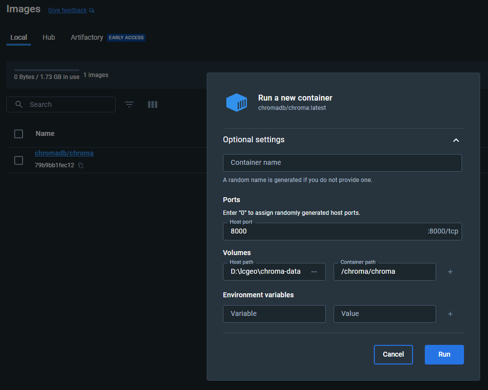

# langchain-geo

Using LangChain, GPT-3 (for now) and semantic linked data to enable a question answering API.

## setup

create, activate and install the venv

```bash
python -m venv venv
source venv/bin/activate
pip install -r requirements.txt

```

additionally, these components are required: [link to GitHub issue](https://github.com/chroma-core/chroma/issues/189#issuecomment-1454418844)

## deployment

ensure the Chroma Docker container is up and running, or langserve connection will fail

then, to run langserve locally just execute the `src/server.py` file 

langserve documentation: [github.com/langchain-ai/langserve](https://github.com/langchain-ai/langserve) 

the frontend component using the langserve endpoints lives in this repository: [github.com/LuisKolb/langchain-geo-frontend](https://github.com/LuisKolb/langchain-geo-frontend) 

### chroma and the docker container

it's easiest to use docker desktop to set up the docker container running chroma

pull the latest version of `chromadb/chroma` from dockerhub, and run it. below is an example configuration:


binding a local volume (in this example `D:\lcgeo\chroma-data`) to the container path `/chroma/chroma` allows you to modify the `chroma.sqlite3` file easily from your own machine. this file is where the actual data is stored, and simply replacing it with your own `chroma.sqlite3` file allows you to transfer the database from one machine to another.

you can also modify the port the container will be exposed on.

⚠️ be careful to use the same port number you specify here in the python chromaDB client, or the connection will fail (obviously).

⚠️ the collection_name string identifies the collection, and is saved to the `chroma.sqlite3` file. to access the collection later (after transferring the file to another machine) you need the same string.

### the whole package as a docker thingy

```bash
docker run --network lc-geo-net --name chromadb chromadb/chroma:latest
docker build . -t lc-geo-api
docker run --network lc-geo-net --name agent -p 8001 lc-geo-api
```